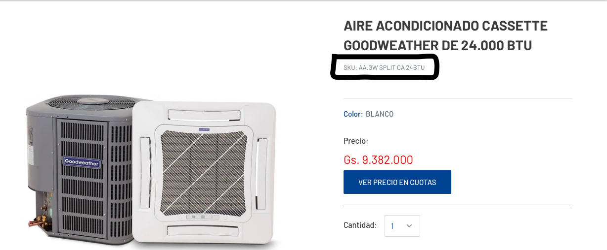
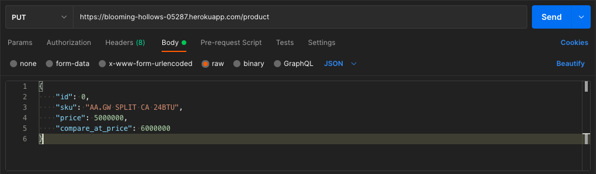
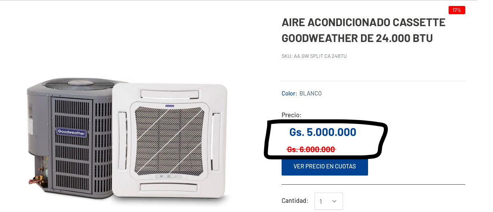

# Go eCommerce API

API para modificar precios de productos en una tienda eCommerce de [Shopify](https://es.shopify.com).

## Instrucciones

1. Ingresar a la [tienda eCommerce](https://inverfin-test.myshopify.com/collections/all).
2. Seleccionar cualquiera de los productos de la lista.
3. Obtener el SKU o código alfanumérico del producto.
   
4. Utilizar algún cliente REST como [Postman](https://www.postman.com) o [Insomnia](https://insomnia.rest/download).
5. Hacer un PUT a "https://blooming-hollows-05287.herokuapp.com/product" con el siguiente payload:



```
id:               Enviar 0, no es necesario para el proceso.
sku:              Código alfanumérico del producto a actualizar. Parámetro necesario.
price:            Precio neto. Parámetro necesario.
compare_at_price: Precio bruto. Parámetro necesario.
```

6. Enviar el request, si se obtiene un status code 200 el proceso fue exitoso.
   Recargar la página del artículo para ver los precios modificados, en algunas ocasiones es necesario recargar varias veces.
   

##

## Gracias por visitar el repositorio ;)

Cualquier feedback y propuesta de mejora son bien recibidos.

###
